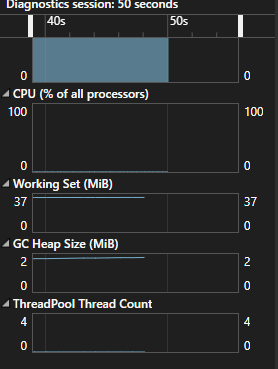
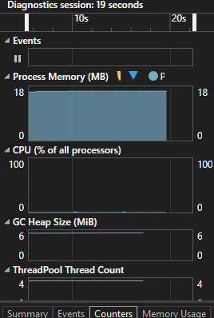

### Understanding Memory Management

## Implementation Details

---

## 1. Value and Reference Types

* Demonstrates the behavior of **value types** and **reference types**.
* Helps understand memory allocation differences between **stack** and **heap**.

### Heap Usage Example:

* **Heap size with 100 element array**: \~2 MiB

  

* **Heap size with 1,000,000 element array**: \~6 MiB

  

---

## 2. Garbage Collection

* Explores memory usage and reclaiming of unused resources.
* Demonstrates how to use `GC.Collect()` to manually trigger the garbage collector.
* Observes impact on heap memory and system behavior.

---

## 3. IDisposable

* Covers how unmanaged memory is handled explicitly.

### Examples:

* **File Reading** using `StreamReader`
* **File Writing** using `StreamWriter`
* **Custom Resource Management** by implementing the `IDisposable` interface to clean up unmanaged resources.

> Implementing IDisposable ensures proper release of file handles, database connections, or any unmanaged memory.

---
