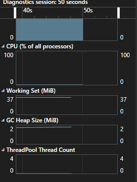
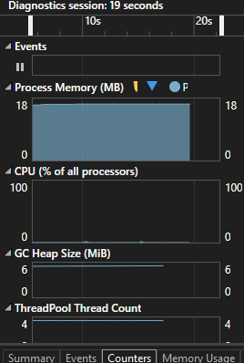

### Understanding Memory Management
 
## Implementation Details
 

# 1.Value And Reference Types
  -  allows to understand the behaviour of value types and reference types 
  -  understanding usage of stack and heap memory

  - heap size for array creation of 100 elements (GC Heap Size 2Mib)

  

  - heap size for array creation of 1000000 elements (GC Heap Size 6Mib)

  
  
# 2.Garbage Collection
  -  allows to understand the memory usage
  -  using GC.Collect to manually trigger garbage collection
# 3.IDisposable
  -  file reading
  -  file writing

