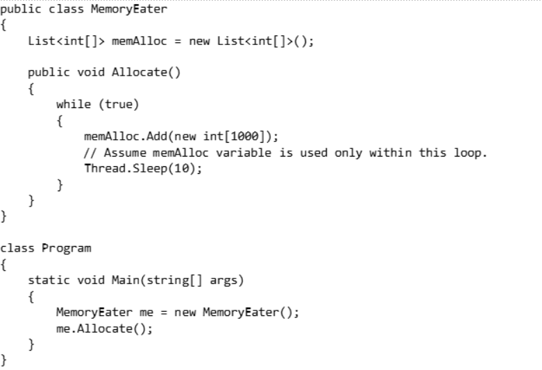
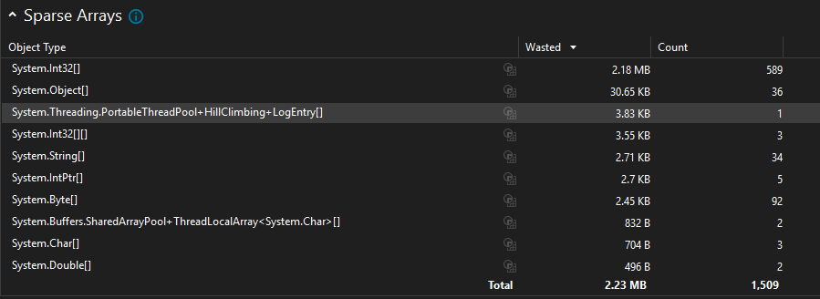
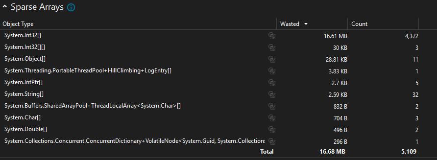
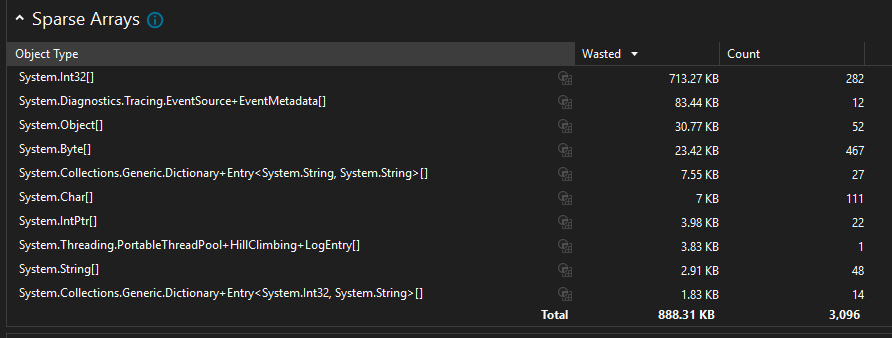
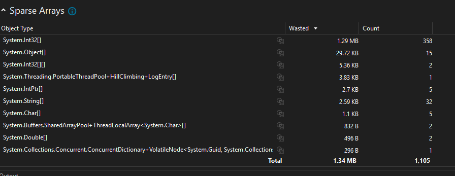
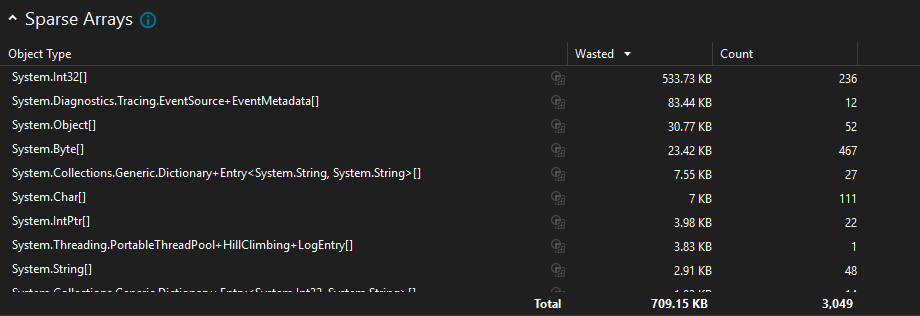
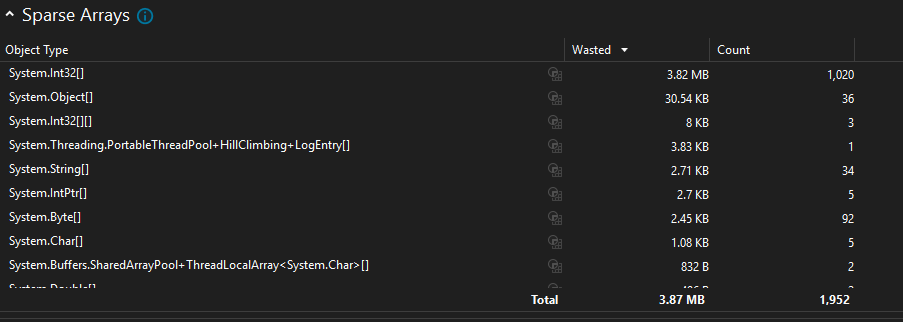

### Memory Management Profiling

## A Simple Memory Management Profiling to Understand the Working of Memory

---

## Objective

- To fix the memory issue in the provided code snippet and implement memory management best practices.

---
## Issue in the given code :

- An infinite while loop continuously creates integer objects and adds them to a list.
- The given code does not have a condition to stop the memory allocation.
- No cleanup mechanism, the allocated memory is not cleared for further processes to make use of.
- Leads to unbound memory usage and potential crash.

## Profiling for Infinite Memory Eater

### Initial Memory Usage (10.80s)  

### Memory Usage After Some Time (73.84s)  

---

## Profiling for Restricted Infinite Memory Eater

- Improved memory management by clearing the memory when the list exceeds 1000 entries.
- Added a check to clear the list after 1000 entries (`list.clear()`).
- Reduced memory usage by triggering garbage collection.(`GC.Collect()`).
- Prevents unbounded memory growth.

### Initial Memory Usage (4.45s)  

### Memory Usage After Some Time (23.34s)  

---

## Profiling for Finite Memory Eater

- Further improved memory management and introduced a finite loop (`while (count < 1000)`).
- Limited memory allocations.
- Controlled execution and predictable memory usage.
- The finitely allocated memory is also cleared by triggering garbage collection.

### Initial Memory Usage (4.68s)  

### Memory Usage After Some Time (20.35s)  

---
