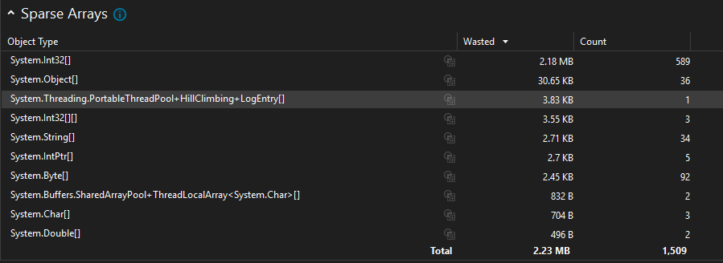
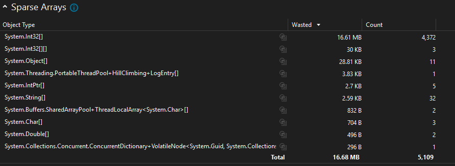
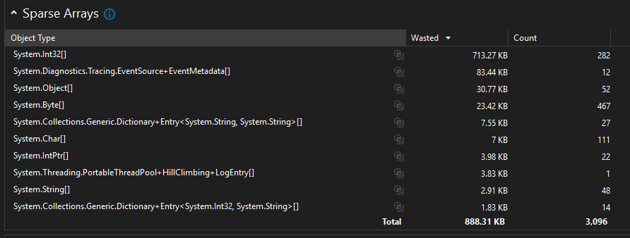
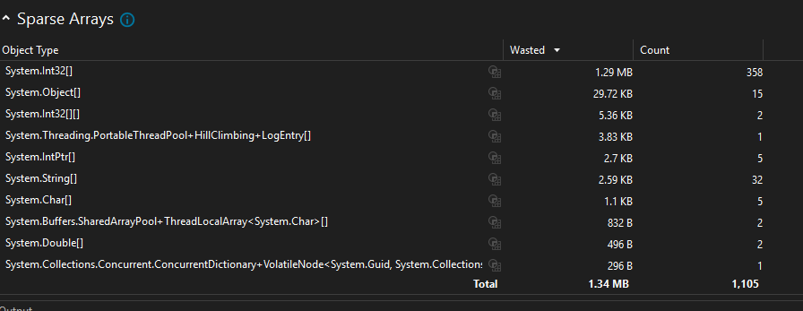
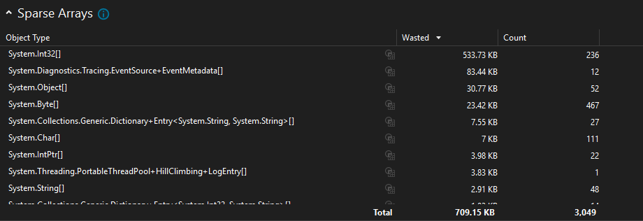
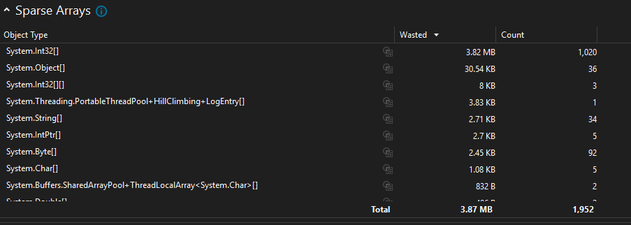

### Memory Management Profiling
### A simple memory management profiling to understand the working of memory

## Profiling for given memory eater:

### Initial memory usage (10.80s)

 
### Memory usage after some time (73.84s)

  
## Objective
 - To fix the memory issue in the provided code snippet and implement memory management best practices. 

## Profiling for improved memory eater-I:
 - Improving memory management by clearing the memory when list exceeds 1000 entires.

 ### Initial memory usage (4.45s)

### Memory usage after some time (23.34s)

## Profiling for improved memory eater-II:
 - Improving memory management by setting a condition and making it a finite while loop.(count<1000)

 
 ### Initial memory usage (4.68s)

### Memory usage after some time (20.35s)

