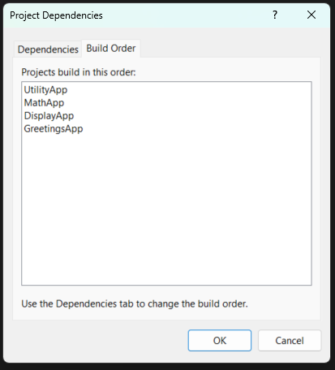

# Assignment-14 | Project, Solutions and Build Orders .

# Summary Report
## 1. Importance of project organisation

Proper project organization involves separating different functionalities into different projects.
In this solution:
- GreetingApp provided the Greetings.(Project A)
- ProjectE provided an interface to handle cyclic dependency between MathApp and DisplayApp.(Additional project to handle dependencies)
- DisplayApp was responsible for managing console display and user interaction.(Project C)
- MathApp included mathematical logic.(Project B)
- UtilityApp provided common helper functions like user input validation.(Project D)

This modular approach made the solution easier to understand, maintain, and extend.Now the functions can be used accross various projects ensuring reusability. 

## 2. Solution Management

Solution management includes adding references and configuring project properties. 
Managing the solution well ensures:

- Proper encapsulation of logic.
- Reusability of code across projects.
- Improves code readability and team collaboration.

Manually setting up project references using Add Reference and checking dependencies in Project Dependencies allowed to understand how projects rely on each other.

## 3. Build Order

Build order determines which projects are compiled first based on their dependencies. If not configured correctly, it can lead to build-time errors such as missing types or unresolved references.
In this project:
- UtilityApp and ProjectE were built first since they required by other projects.
- DisplayApp was built next because it relied on the previous two.
- MathApp was built next as it relied on DisplayApp
- GreetingApp with the main entry point was built at last .

Configuring the build order ensured that all dependencies were satisfied during the build process, leading to a smooth and error-free compilation.

## Before ProjectE
    Project A: "GreetingsApp" 
    Project B: "MathApp" 
    Project C: "DisplayApp" 
    Project D: "UtilityApp" 
Set Project B as a dependency for Project A, Project C as a dependency for Project B, and Project D as a dependency for Project C.
The solution wasn't built properly as DisplayApp uses MathApp's functionalities but MathApp has reference of DisplayApp.
This causes a cyclic dependency restricting the solution from building.

## Build order after modification

Here
I've understood working with multiple projects , their references and dependencies for a clean and collaborative working experience.
### Project Structure
 Assignment-14/
    CSharpConsoleSolution/
        DisplayApp/
          Displayer.cs
        GreetingsApp/
          Program.cs
        MathApp/
          MathUtils.cs
        ProjectE/
          IMathHelper.cs
        UtilityApp/
          Helper.cs
