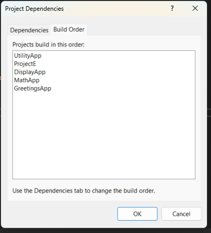

# Assignment-14 | Project, Solutions and Build Orders

---

## Summary Report

### 1. Importance of Project Organisation

Proper project organization involves separating different functionalities into different projects.

In this solution:

- **GreetingsApp** provided the greeting logic. *(Project A)*
- **ProjectE** provided an interface to handle cyclic dependency between MathApp and DisplayApp. *(Interface Project)*
- **DisplayApp** managed console display and user interaction. *(Project C)*
- **MathApp** included the mathematical logic. *(Project B)*
- **UtilityApp** provided helper functions like user input validation. *(Project D)*

>  This modular approach made the solution easier to understand, maintain, and extend.  
>  Functions can now be reused across multiple projects.

---

### 2. Solution Management

Effective solution management includes adding references and configuring project properties.

Benefits of proper solution management:

-  Better encapsulation of logic
-  Reusability of code across projects
-  Improved code readability and collaboration

Manually setting project references using **"Add Reference"** and inspecting **"Project Dependencies"** helped understand the inter-project relationships.

---

### 3. Build Order

Build order determines the sequence in which projects are compiled based on dependencies.

If incorrectly configured, it can lead to:

-  Missing types  
-  Unresolved references  
-  Build-time errors

####  Final Build Order:

1. **UtilityApp**  
2. **ProjectE**  
3. **DisplayApp**  
4. **MathApp**  
5. **GreetingsApp** (Main entry point)

>  This order ensures that all dependencies are resolved during build, allowing a clean and successful compilation.

---

###  Before Using ProjectE (Cyclic Dependency Issue)

- **Project A:** GreetingsApp  
- **Project B:** MathApp  
- **Project C:** DisplayApp  
- **Project D:** UtilityApp  

Scenario:

- Project A depends on Project B  
- Project B depends on Project C  
- Project C depends on Project D  
- **But:** Project C also needs Project B, which creates a **cyclic dependency**.

 This cyclic reference caused the build to fail.

---

###  After Adding ProjectE (Fixed Build Order)

By introducing **ProjectE** (interface-only project), the cyclic dependency was broken and the solution built successfully.

---

